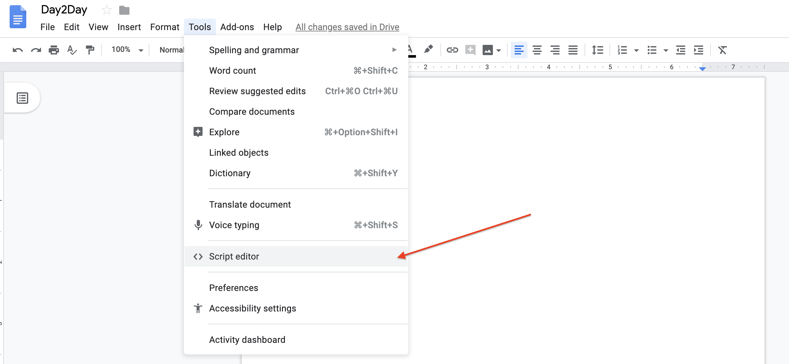
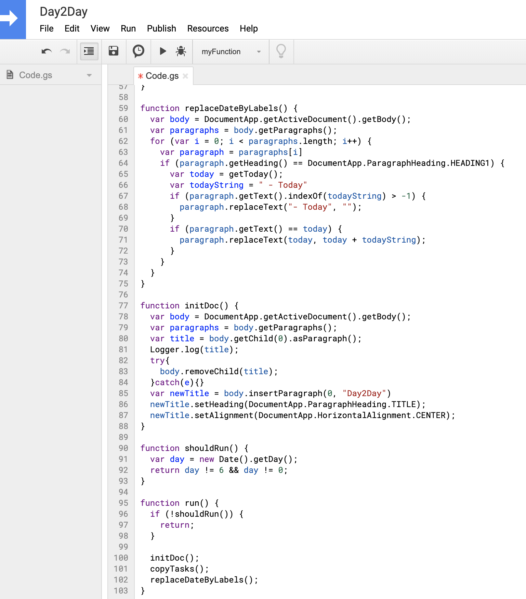
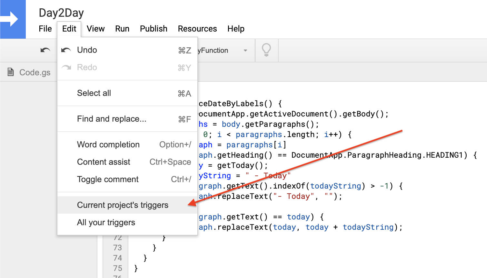
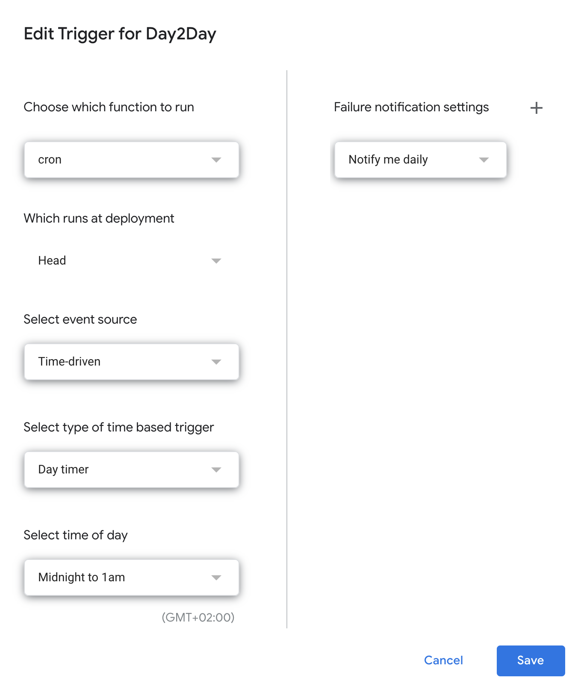
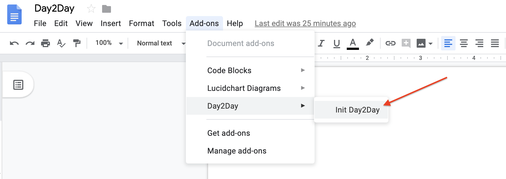
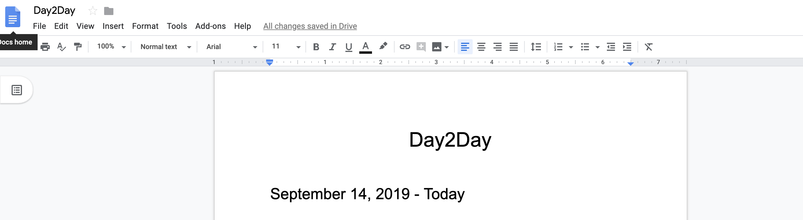

# Day2Day

## What is Day2Day?

Day2Day is a task manager operating on Google Docs.
It's simple and it just works.

## How does Day2Day work?

Every day you write your tasks on a Google Docs the same way you see on the screenshot.

In order to mark the task as done, you only have to strikethrough your task. (Cmd + shift + x on Mac or Alt + Shift + 5 on Windows/Linux)

The script will be run automatically every weekday between midnight and 1am, will copy the uncompleted tasks from the previous day.

## Setup

### Step 1: Create new Google Docs.

Create a new Google Docs.
You can name it the way you want, Day2Day in my case.

### Step 2: Open Script Editor.

Click on **Tools** / **Script Editor**.

### Step 3: Copy the code.

Delete all code.
Copy the content of this [file](https://raw.githubusercontent.com/papay0/Day2Day/master/Code.gs) and paste it in the Script Editor tab.
You can name it the way you want, Day2Day in my case.

It should now look like this:

### Step 4: Make this script run periodically.

Click on **Edit** / **Current project's triggers**.

### Step 5: Make this script run periodically.

- Click on **Add Triger**. (bottom right)
- Select **cron** for *Choose which function to run*.
- Keep the default choice **Head** for *Choose which deployment should run*.
- Select **Time-driven** for *Select event source*.
- Select **Day timer** for *Select type of time based trigger*.
- Select **Midnight to 1am** for *Select type of time based trigger*.
- For *Failure notification settings*, you can choose, I selected **Notify me immediately**.
- Click **Save**.

It should look like:

### Step 6: Give permissions.

Google might ask you to login with your current account, then to **Allow** this script to *View and manage your Google Docs documents*.
This script needs this permission otherwise it won't be able to update automatically your document.

### Step 7: Initialize the document.

Go back to your Google Docs and refresh the page.
Click on **Add-ons** / **Day2Day** / **Init Day2Day**.

You should see the following, with today's date:

You can now start writting your tasks following the same pattern as the picture on the top of this document, ie using bulleted list.

Enjoy! 🥳

## Motivation && Previous work

I am using the Google Docs for daily tasks for a few years now.
I always found it too much to copy paste the previous day, to remove the completed tasks, every single day. (Yes, I like automation!)

So I wrote a React webapp to do this job for me, the code is available [here](https://github.com/papay0/day-to-day).
But after a while it became too complex for the simple task manager I needed.

Quick demo:

There is also support to easily build a **Promo package**, often used in tech companies.
When Promo comes, instead of spending a week looking for your best commits/documents, you could just write it the Promo section using markdown.

So after giving up on my webapp, I went back to my simple Google Docs and wrote the automation using **Google Apps Script**. ❤️

## Improvement

- [ ] When all subtasks are done ✅, treat the master task as done ✅.
- [ ] See if Day2Day can be a Docs Add-on.
- [ ] Create a **backlog** category.

